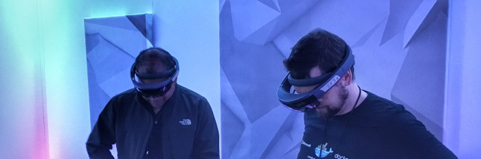

# Microsoft Build 2017: Lifting the Containers into the Cloud
**Solita sent a two-man strike team to Microsoft Build at Seattle in the beginning of May. The Build conference is one of the biggest annual Microsoft developer ecosystem conferences that is held somewhere in the West U.S annually. This year's Build was held in downtown Seattle. In the Conference Microsoft rolled out a number of announcements and sessions that centered around Azure, Windows Containers, .NET, Cross platform, and Mixed reality. The topic I found personally most intriguing was the arrival of Docker Containers to the Windows ecosystem**

## Build 2017

The conference was a three-day run packed with sessions. Additionally there was an option to participate in pre-day sessions that included topics from Windows Containers and Serverless solutions. We chose the container track and were not disappointed. This year Build boasted xxxxx to yyyy participants, depending on the source. Also, this year the weather gods merciful and we enjoyed sunny weather in usually rainy Seattle. As is the tradition, the queues were long in the conference and while we're complaining, we might as well say that the food was a bit of disappointment :). Then again, the informational content in the sessions was exceptional, so one may as well 'suffer' a few minute nuisances for it :).

_MSBuild Keynote day 1_

## Most important themes
On previous years, Build has boasted the biggest developer related announcements of the year. This year, nothing HUGE was announced, but then again many of the announcements did fall into themes that Microsoft sees important in the coming years. I consider these themes to be following:

### The Cloud 
If one should choose the biggest theme in this year's build, it's definitely the cloud. A big portion of the announcements and sessions were directly related to Azure or then again were built on Azure. Yes, the cloud isn't exactly a new thing, but it's worthwhile to notice that Microsoft continues heavily investing on Azure. Also, I suspect that while the Windows O/S revenues keep declining, Azure is expected to take it's role as Microsoft's milk cow. 

The biggest announcement related to Azure was the CosmosDB. Essentially [CosmosDB](https://azure.microsoft.com/en-us/services/cosmos-db/) is a direct successor to DocumentDB but with global distribution. And lets not forget the striking name the Marketing department (?) came up with. Admitted, "CosmosDB" does tend to be more striking than "DocumentDB 2.0".

### Cross platform
Cross platform continues to be a thing in the modern Microsoft developer ecosystem. This theme, similar to the cloud, was one of the big themse that underlined many of the sessions. Personally I'm still a bit baffled how fast the change has been. Just after few years after the original announcement we've working crossplatform solutions in Visual Studio, SQL Server and ASP.NET. Just to mention a few. 

Announcements directly related to cross platform story were that Ubuntu is now available in the Windows store and that Fedora and Suse distributions are not far behind. These are all built on the Windows Subsystem for Linux (WSL).

_Yes. That's Scott Hanselman using Bash inside the new Azure Mobile App to SSH into a Linux server during Build keynote_

### Mixed Reality. 
New venture that could become everyday soon. 

### .NET
 Over the past few years .NET has transformed from a monolith library into a sleek cross platform library, to which anybody can contribute on Github. To my eye, it's future looks bright. 
 
.NET was also once yet again one of the major themes in Build. ASP.NET Core 2 is on it's way and the preview of 2.0 was announced during Build. Version 2.0 brings welcome changes. This includes the new Microsoft.AspNetCore.All "meta" Nuget package, which removes the need to list separate .NET feature packages in the project file in most cases. This also simplifies the process of upgrading the .NET dependency for ASP.NET core projects. Other new features are listed more than abundantly [here](https://blogs.msdn.microsoft.com/webdev/2017/05/10/aspnet-2-preview-1/). 

Also, contrary to some rumors, .NET Standard concept is not fading away, but lives strong. On Build, .NET Standard 2.0 was released which .NET Core 2 implements. Overall, it's a fantastic time to be a .NET developer.

### Docker containers
The last but not the least theme is the Windows Containers. Microsoft has been now co-operating with Docker for some time in order to bring Windows into the Container space. This includes big changes in the Windows Kernel to make it Container-compatible and also large investments in the Azure infrastructure and tooling to make it the best Container platform in the existence. The whole Windows Container story is intriguing if not revolutionary. This brings us to the second part of this post, of which I will continue for the few next chapters

## The Windows Container Story

Docker and Containers are sort of new thing for the Microsoft ecosystem developers. My first run in with them was when Microsoft demoed a .NET app running inside a Windows container during Build 2015. So, sort of, like many other .NET developers, I'm just beginning my Docker journey.

## Containers?

Short recap: Containers are the next evolutionary step in virtualization technology. While the current virtualization technology enables IT departments to run multiple operating systems inside another operating system on top of single hardware, containers _share_ the host operating system. Or the kernel at least. This means that we do not have to duplicate the guest O/S in containers as we have to it today with virtual machine images. A container does not include a full O/S, but instead only the settings and libraries that are needed for the app the run. This is illustrated in the image below:

The virtualization technology back in the 2000s was revolutionary for IT departments as it allowed them to deploy apps more densily on the same hardware. Containers continue take this trend even further, as containers can be deployed even more densily as the containers have a much smaller footprint in terms of size when compared to a VM image. 

However, the virtualization technology from the 2000s did not affect developers directly. Containers do as they change how software is developed and also deployed.

## That's great, but in practice...?

## The Now and the Future for Windows Containers

During Autumn 2014 Microsoft announced that the Docker containers are coming to the Windows ecosystem and the first Docker container running on top of Windows Server was shown on Build 2015 half a year later. 

