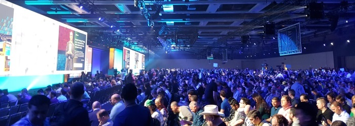
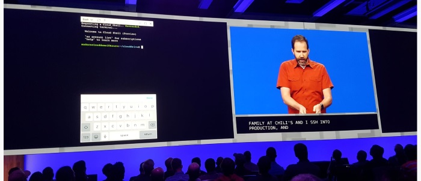

# Microsoft Build 2017: Lifting the Containers into the Cloud
**Solita sent a two-man strike team to Microsoft Build at Seattle in the beginning of May. The Build conference is one of the biggest annual Microsoft developer ecosystem conference that is held annually somewhere in the West U.S. This year Build was held in downtown Seattle. Microsoft rolled out a number of announcements and sessions that centered around Azure, Windows Containers, .NET, Cross platform, and Mixed reality. In this blog post I'll cover my impressions of the first three.**

## Build 2017

The conference was a three-day run packed with sessions. Additionally there was an option to participate in pre-day sessions that included topics from Windows Containers and Serverless solutions. We chose the container track and were not disappointed. This year Build boasted xxxxx to yyyy participants, depending on the source. Also, this year the weather gods merciful and we enjoyed warm weather in usually rainy Seattle. As is the tradition, the queues were long and now that we started complaining, the food was a bit of disappointment. Then again, the informational content in the sessions was exceptionally good, so one may as well 'suffer' a few minute nuisances for it :).

_MSBuild Keynote day 1_

## Most important themes
On previous years, Build has boasted the biggest developer related announcements of the year. This year, nothing HUGE was announced, but then again many of the announcments did fall into themes that Microsoft sees important in the coming years. I consider these themes to be following:

### Cloud 
If one should choose the biggest theme in this year's build, it's definitely the cloud. A big portion of the announcements and sessions were directly related to Azure, or were built on Azure. Yes, Cloud isn't exactly a new thing, but it's worthwhile to notice that Microsoft continues heavily on Azure. Also, I suspect that while the Windows O/S revenues keep declining, Azure is expected to take it's role as Microsoft's milk cow. The biggest announcement related to Azure was the CosmosDB. Essentially CosmosDB is a direct successor to DocumentDB but with more global reach. And with a striking name :)

### Cross platform
Cross platform continues to be a thing in the modern Microsoft ecosystem. Personally I'm a bit baffled how fast the change has been. Just after few years we've working crossplatform solutions in Visual Studio, SQL Server and ASP.NET. Just to mention a few. On the Windows Subsystem for Linux (WSL) front Microsoft announced that Ubuntu is now available in the Windows store and that Fedora and Suse distributions are not far behind.

_Yes. That's Scott Hanselman using Bash inside the new Azure Mobile App to SSH into a Linux server during Build keynote_

### Mixed Reality. 
New venture that could become everyday soon

### .NET
 .NET has transformed from a monolith library into a open source ecosystem, which now also runs in Linux, Mac and mobile devices.

### Docker containers
The last but not the least theme is the Windows Containers. Microsoft has been now co-operating with Docker for some time in order to bring Windows into the Container space. This includes big changes in the Windows Kernel to make it Container-combatible and also large investments in the Azure infrastructure and tooling to make it the best Container platform in the existence. I consider the whole Windows Container story to be intriguing if not revolutionary so I will continue on the subject for the rest of this post.

## The Windows Container Story

## That's great, but in practice...?

## The Now and the Future for Windows Containers

