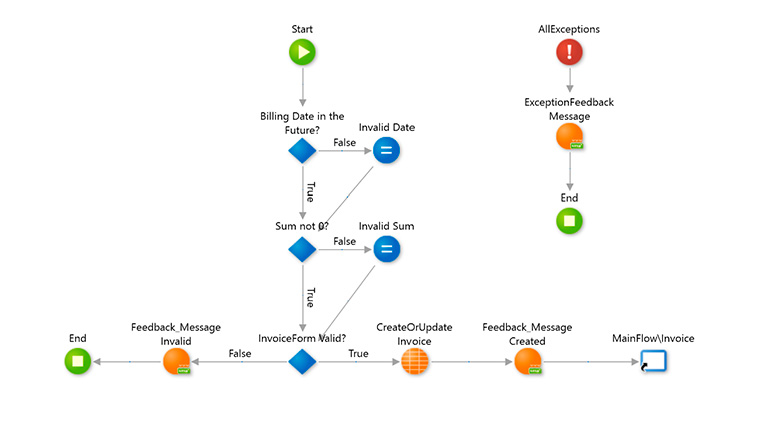
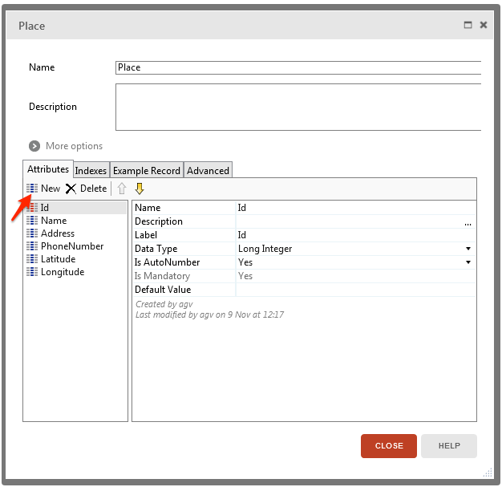

layout: post
title: I challenged low-code with code
author: hnybom
excerpt: > Low-code platforms will account for 65% of application development by 2024. So how much is there still need for building applications with traditional coding? 

tags:
 - Low-code
 - OutSystems
 - Spring
 - Vaadin
 - Kotlin

# Low-codecalypse

Low-code platforms will account for 65% of application development by 2024 says Gartner 

> https://venturebeat.com/2021/02/14/no-code-low-code-why-you-should-be-paying-attention/

Development with the low-code platforms is stated to be 5 to 7 times faster than traditional development. Time to apply for early retirement I guess, so long and thanks for all the fishes!

Well...maybe, just maybe there is still a chance for us traditional devs as well. There are fast catalog of open source components that do similar things that low code does. In this blog I'm going to write a simple web application with productivity boosting OS components. 

## So why is low-code so great?

In this blog I'm going to use OutSystems as the representation for low-code platforms. OutSystems is a platform I've used and I also have a OutSystems developer certificate. So I do know something about it. The intention of this blog is not to undersell low-code in any way. On the contrary I feel that OutSystems at least can do many things very well, not all, but many.

Low-code platforms are usually graphical based programming where many common features come out of the box. Following picture depicts the what low-code logic programming looks like with OutSystems



***OutSystems logic diagram***

From these graphical presentations OutSystems creates C# code and jQuery / React web application. If you're interested to learn  OutSystems they provide a free developer environment to test out the platform and, in my opinion, one of the best practice materials I've come across:

>  https://www.outsystems.com/training/paths/

In this not so deep dive I'm going to focus certain aspects of development. First let's go through them with the focus on OutSystems.

### Development environment 

In OutSystems the development is always done in the cloud environment. This has multiple implications

* No need to setup anything 
* The environment is shared with all the developers
* Internet connection is needed for the development

You write your applications mainly with the OutSystems service studio IDE. Service studio is currently a Windows only tool so that restricts the developer to windows platform. OutSystems is building a new cross-platform version of the service studio so after that you'll be able to use it with a mac as well. 

For developing native C# components OutSystems offers integration studio and for managing the different environments you use the lifetime web application.

### Data access

Data access consists of two parts, data mapping to code objects and accessing data from the database. OutSystems provides these functionalities in a standard way that is built into the platform. 

OutSystems uses ORM technology as its data access. It also generates the DB schema based on the created entities same way as hibernate does when hbm2ddl.auto is set to update the DB. As you know use of hbm2ddl is discouraged in production as it can lead to unforeseen consequences in the DB schema. In my experience this is also the case with OutSystems. If you e.g. drop a property from an entity the column will stay in the DB it's just hidden. The same is true if you delete an entity the table will still be there. This will not break the system but will lead to a bloated DB. This is undoubtedly fast but also little risky.

The modeling with OutSystems is done  by a graphical interface where you create the entities. This combines the entity models and the DB structure.



**OutSystems entity creation**

For fetching the entities OutSystems creates basic CRUD methods to access the data automatically and you can create your own aggregates as well. This is done with drag and dropping entities to a excel like interface. On top of that OutSystem can use of custom SQL queries to access data. So the access pattern is really comprehensive but then again if you start to implement SQL queries you're at the same level as coding.

### Frontend 

OutSystems has multiple variants for frontend. It has the traditional which is like a HTML page with jQuery and the reactive which is React based responsive application with PWA capabilities. OutSystems also enables you to build mobile applications which are actually react native applications.

With OutSystems creating views is done using components such as a list. To populate a list with data you create a data aggregate from your entities and then drag and drop the fields of the aggregate to the list. This creates a list view with the selected fields. 

Creating views from components is the main benefit for OutSystems. The speed which you can create views is very fast. On top of component based view creation OutSystems has a large catalog of view templates that you can use as a basis for your application. Template creates the UI components and then you can select what data is used to populate them. You can also modify the template instances to suit the application needs. You can find the built in templates at

> https://outsystemsui.outsystems.com/OutSystemsUIWebsite/ScreenOverview?RuntimeId=2

### Logic

Writing logic is a common task in many parts of an application. With OutSystems you use graphical presentation to implement your logic operations. This is depicted below. 


***OutSystems logic***

The above logic is basically this

```kotlin
val list = MutableList()
for(i < 5) {
    list.add(i < rating)
}
return list
```

OutSystems has also feature called business process orchestration which is used to model long-running workflows in a visual manner. This is done in a similar visual presentation which helps in the design as it can be shown to the business owners in a manner they understand.

When the graphical presentation is not enough OutSystems supports C# components as extensions. 

### Deployment

OutSystems can be run in 

* OutSystems cloud environment 

* Your own cloud environment like Azure

* On-premise installation

We'll concentrate on the OutSystems cloud where you get 3 stages out of the box (dev, test and prod). You can publish your changes straight from the service studio with it's one click deployment to the dev environment. To promote the application version to higher stages you use the lifetime web application.

This is kind of CD but with human interaction. Lifetime does have APIs to integrate e.g. jenkins to it but I'm not going to cover that in this blog. You can find more information from the link below

> https://success.outsystems.com/Documentation/How-to_Guides/DevOps/How_to_automate_container_deployment_by_using_LifeTime_API_v2_and_Jenkins

For automated testing OutSystems has a separate BDD framework that you need to add for your testing project. This is also out of scope of this blog. More info at

> https://success.outsystems.com/Documentation/How-to_Guides/DevOps/How_to_Automate_Unit_Testing_and_API_Testing

So in summary what you get automatically is 3 environments and manually triggered deployment to them. Anything more requires just as much work as it does with any other tool.

## A challenger appears

As promised I'm going to build an web application and compare that development through the aspects covered in the previous OutSystems chapter. The application will be a web application for game high scores. Basically it will have a list of games and their high scores and a form to add more high score entries to a game.

To challenge the the speed of low-code I'm going to need some help. So I'm going to use the following stack to develop at speed

* **Vaadin** **flow** for UI 
* **Spring boot** for backend server
* **Spring data JDBC** for DB access
* **Kotlin** as the programming language

### Development environment 

To save some time on starting the development I'm going to use spring initializr web app 

> https://start.spring.io/ 

to generate the needed skeleton for the project. 


***Spring initializr UI***

In the initilizr you just fill in the information about the project and select languages and dependencies you want to use. After that you just download the skeleton as a zip-file and of you go. 

I'm going to develop the application on my local machine so I need a local dev environment that can be easily debugged and tested. Spring boot is pretty self contained but what is needed is a database. For this I'll use docker compose to quickly get a local testing portgresql database.

```
version: "3.7"
services:
  low-code-postgres:
    container_name: low-code-postgres
    restart: always
    image: postgres:latest
    volumes:
      - ./database:/var/lib/postgresql/data
      - ./shared:/shared
    ports:
      - "127.0.0.1:5432:5432"
    environment:
      POSTGRES_USER: lowcode
      POSTGRES_PASSWORD: vscode
      POSTGRES_DB: lowcodedb
```

To start the db I just need to issue docker-compose up command.

In reality that really didn't take too much time but it's still more than getting everything out of the box. 
### Data Access 

For DB access there is a fast spectrum of libraries and I've chosen spring data JDBC. Spring data JDBC is not as comprehensive as a full ORM but rational against ORMs like JPA is the complexity. It wouldn't be a problem in a simple app as this but in a large scale application it can be very confusing. Spring data JDBC gives some rational why to use it

>If you load an entity, SQL statements get run. Once this is done, you have a completely loaded entity. No lazy loading or caching is done.

> If you save an entity, it gets saved. If you do not, it does not. There is no dirty tracking and no session.

> There is a simple model of how to map entities to tables. It probably only works for rather simple cases. If you do not like that, you should code your own strategy. Spring Data JDBC offers only very limited support for customizing the strategy with annotations.

I like the opinionated simple approach where you know what you get and there is not much magic behind the scenes.

For the database I need migrations and the data models for the code side. For migrations I'll use flyway which integrate into the spring boot application. I only need to write the SQL script files that will be run when the application starts. On top of the migrations I'll create spring data jdbc entity classes.

```kotlin
@Table("games")
data class Game(
    @Id
    val id: Long?,
    @Version
    val version: Long?,
    val name: String,
    val genre: String,
    val platform: String,
    val publisher: String,
    val rating: String,
    @Column("release_year")
    val releaseYear: Int,
    @Column("review_score")
    val reviewScore: Int,

    val highScores: Set<HighScore>) {

    fun getSortedScores(): List<HighScore> {
        return highScores.toList().sortedBy { it.score }
    }
}

@Table("high_scores")
data class HighScore(
    @Id
    val id: Long?,
    @Column("game_id")
    val game: Long?,
    @Column("gamer_name")
    val gamerName: String,
    val score: Long,
    val created: LocalDateTime
)
```

Spring data maps the DB tables to these data classes using the property names or the `@Column` annotation instructions. It also takes care of optimistic locking with the `@Version` annotation.

> **A note about optimistic locking.** Spring data JDBC supports optimistic locking at the aggregate root level, the game entity in this case. This is quite wide lock as you should be able to add multiple high scores independently. In this demo app it's just fine but in a real world case take this into consideration.

To match the magic of OutSystems spring data provides quick methods for DB access by simply creating a repository interface.

```kotlin
@Repository
interface GameRepository : PagingAndSortingRepository<Game, Long> {

    fun findByNameContainingIgnoreCase(name: String, pageable: Pageable): List<Game>

    @Query("select * from games where name like :name and review_score >= :minScore")
    fun findByNameAndMinimumScore(name: String, minScore: Int)

}
```

Spring automatically generates a implementation based on the signature of the interface. So 

`fun findByNameContainingIgnoreCase(name: String, pageable: Pageable): List<Game>`  

will create a method for finding a game where name like the name parameter. The pageable attribute  enables sort and paging for this query. Custom queries can be added as well like the  `findByNameAndMinimumScore`. On top of that note the extension of `PagingAndSortingRepository<Game, Long>` this creates a large set of CRUD methods for free. This matches and, in my opinion exceeds, the functionality found in OutSystems for writing simple queries.

For more complex queries we can use jdbc template to write pure SQL so it''s the same as with OutSystems. In my opinion this kind of hybrid a repository model works very nicely since you will need the basic CRUD methods as well as the more complicated ones. With spring data you get the CRUDs + extra basically for free.

### Frontend

There are many great alternatives for creating rich client applications but for the sake of speed I've chosen Vaadin flow. With Vaadin flow the UI is implemented at the backend and the actual client code is generated from the Kotlin / Java code. The programming style is reminiscent of desktop applications where components generate events that you listen to e.g. value changed and so on. Vaadin takes care of the communication between the client application and the backend so you can just concentrate on writing the logic.  On top of Vaadin flow I've also added karibu dsl library that enables structured coding style for vaadin flow UIs using the idea behind kotlin's type-safe builders

> https://kotlinlang.org/docs/type-safe-builders.html

So to create a grid view of the games in the database I write the following code

```kotlin
appLayout {
    content {
        verticalLayout {
            h2("Games")
            grid(dataProvider = DataProviders.getDataProvider(gamesRepository)) {
                addColumn(Game::name).setHeader("Name").setSortProperty("name")
                addColumn(Game::platform).setHeader("Platform").setSortProperty("platform")
                addColumn(Game::publisher).setHeader("Publisher").setSortProperty("publisher")
                val rs = addColumn(Game::reviewScore).setHeader("Review score").setSortProperty("reviewScore")
                addColumn(Game::releaseYear).setHeader("Released").setSortProperty("releaseYear")
                sort(
                    GridSortOrderBuilder<Game>().thenDesc(rs).build()
                )
            }
        }
    }
}
```

The structured style immediately shows how the actual UI layout constructed. The key points to take away are the grids data provider and the mapping of grid columns to the database entity properties. The data provider is a Vaadin concept that well provides data for the UI component. For this purpose I wrote a little helper object to generate data providers from spring data repositories.

```kotlin
fun <T, F> Query<T, F>.toSpringDataPageRequest() =
    PageRequest.of(offset / limit, limit, VaadinSpringDataHelpers.toSpringDataSort(this))

object DataProviders {

    fun <T,ID> getDataProvider(pagingAndSortingRepository: PagingAndSortingRepository<T,ID>): DataProvider<T, Void> {

        return DataProvider.fromCallbacks(
            { pagingAndSortingRepository.findAll(it.toSpringDataPageRequest()).stream() },
            { pagingAndSortingRepository.count().toInt() }
        )
    }
}
```

This uses callbacks to the repository to get the actual data as well as the count of the items.  Oh did I mention that the grid is lazy loading and sortable. Behind the scenes data is queried for the next page when user scrolls the grid. 


***Vaadin games grid***

Now I've the games listed and I want to show the high scores for them. I'll create a Vaadin dialog with another grid of high scores and a form that is used to add more of them. 

The high score grid is similar as the games grid and it gets it's data from the games entity set of high scores.

For the high score form I'll create a form with Vaadin components as inputs. Vaadin has a binder concept where you can bind objects to form inputs and it will populate the data from and to the object instance. Vaadin inputs support validation and you only write the logic once and it's executed both in the client and the server. For different types of data there are a bunch ready made input components such as a date picker and so on. Bellow is a code snippet for high score addition. 

```kotlin
verticalLayout {
    addClassName("add-high-score-form")
    h4("Add new high score")
    formLayout {

        val binder = BeanValidationBinder(HighScoreUIModel::class.java)

        textField("Gamer name") {
            bind(binder).trimmingConverter()
            .withValidator({ name -> name?.isNotEmpty() ?: false}, "Name cannot be empty")
            .bind("gamerName")
        }

        integerField ("Score") {
            bind(binder)
            .withValidator({ score -> score ?: 0 > 0 }, "Score needs to be larger than 0")
            .bind("score")
        }

        dateTimePicker("Created") {
            bind(binder)
           .withValidator(
               { created -> created?.isBefore(LocalDateTime.now()) ?: false },
               "Time cannot be in the future or empty"
           )
           .bind("created")
        }

        binder.bean = HighScoreUIModel(gameId = gameId)

        horizontalLayout {
            button("Add") {
                addClickListener {
                    handleAddition(binder)
                }
            }
            justifyContentMode = FlexComponent.JustifyContentMode.END
            setWidthFull()
        }
    }
}

private fun handleAddition(binder: Binder<HighScoreUIModel>) {
    if (binder.validate().isOk) {
        EventBroker.sendEvent(
            HighScoreAdded(
                game = gamesService.addHighScoreToGame(binder.bean)
            )
        )
        binder.bean = HighScoreUIModel(gameId = gameId)
    }
}
```

 On top of the form creation there is also the action handler for the Add button to save a new high score to the database. The save logic is in the `handleAddition` function. So this is what it looks like.


So it's pretty fast and easy to create these forms with Vaadin.

You've might have noticed the event broker in the handle function. That is an extra feature I added to support cross user data updates with push. What is needed is the Push annotation to the Vaadin application shell.

```kotlin
@Push
class ApplicationShell : AppShellConfigurator 
```

The `@Push` annotation enables reactive functionality so you can "push" changes from the backend threads to the frontend through a websocket. The event broker is custom code that uses a simple memory based registry of listeners of events. I use it to refresh the high score dialog grid for added high scores

```kotlin
// Listener
with(EventBroker) {
    registerForEvents(HighScoreAdded::class.java) {
        if (it.game.id == game.id) {
            game = it.game
            // Push event to the front end with synchronized access
            ui.get().access {
                grid.setItems(DataProvider.ofCollection(game.getSortedScores()))
                grid.refresh()
            }

        }
    }
}

//---------

// Triggering
EventBroker.sendEvent(
    HighScoreAdded(
        game = gamesService.addHighScoreToGame(binder.bean)
    )
)
```

In practice this means that if the dialog is open in multiple different browsers the update the data automatically when it changes.

### Logic

I've encountered a little problem. My application is so simple it has hardly any logic. So let's revisit the example from the OutSystems chapter. If you recall the graphical logic example it used loop to populate an array with boolean values. It's a very simple example from one of the OutSystems training materials. I remember that when I was doing the exercise it felt really cumbersome to write.  The reason for it is that it really was. With kotlin I would write it like this

```kotlin
fun createStarArray(rating: Int) = (0..4).map { it < rating }
```

When it comes to implementing logical operations traditional coding is much faster and for a coder easier to read. For a non coder the graphical version is more clear. 

The OutSystems long-running business processes are little bit out of scope here but there are OS tools to achieve similar modeling. I'll just list some of the tools here and won't go through them in any more detail

* https://spring.io/projects/spring-statemachine
* https://www.activiti.org/
* https://camunda.com/products/camunda-platform/

### Deployment

Modern cloud platforms are pretty great as they are basically infrastructure implemented with software but even that requires you to define what you need in a quite detailed manner. 

To achieve similar level of deployment as with OutSystems I decided to host my application in Heroku. What that meant was that I headed to Heroku web site and registered an account and then created an application which I linked to the github repository. I also selected I wanted a postgresql database and I was done.


Heroku automatically detected that I had an spring boot application and build and deployed it to staging. It also set the detabase environment variables so that the spring would pick them up and use that for it's database. This took literally 10 minutes and the cost for a small application is 0e. 

> **Note** the free level at Heroku isn't really feasible for production level software as 
>
> * It turns it self of if there's no traffic for 30 mins 
> * Has a cap of 10 000 rows in the DB.

I'd say it's pretty close to getting ready made environment. Heroku also has the concept of review apps where it will create a new environment from pull request for testing, it costs extra so I didn't enable them. On top of the CD functionality Heroku offers a CI testing as well but this is also a paid feature so I didn't use it.

The application in this blog is available for a limited time at

>  https://lowcode-challenge-staging.herokuapp.com/

and

> https://lowcode-challenge-prod.herokuapp.com/

Also source code for it is available at

>  https://github.com/hnybom/low-code-vs-code

## Final thoughts

Let's have a quick comparison for the different categories

| Category    | OutSystems                                                   | Code                                                         |
| ----------- | ------------------------------------------------------------ | ------------------------------------------------------------ |
| Data access | Automatic generation for basic access and support for complex queries with SQL | Automatic generation for basic functionality, signature based query generation as well ass support for SQL queries |
| Frontend    | Large template and component library for creating views as well as support for mobile applications. There is not that much room to customize the look and feel efficiently. | View components that are used for composing views            |
| Logic       | Graphical interface for writing logic which easy to read if the reader doesn't understand code. The implementation is cumbersome and slow compared to writing code. | Very powerful way of expressing logic in many different ways. This is the strong point of code. There of course is a steeper learning curve than in low-code |
| Deployment  | Three stage environment out of the box. Limited support of automatic testing. | Many public cloud options with different focus areas and complexities. You can select what you need. In any case requires some work. |

> **Note** I've not covered all of the features here so this is just a limited view of the low-code platforms. They many more features that increase development such as fast integration to APIs and to certain products such as SAP.

With OutSystems you get a whole platform with it's strong points as well as weaknesses. It's a whole package take it or leave it. It's also quite expensive so in many ways it's a strategic decision as in reality your solutions will be tied to the platform you select. Yes I do know you can export OutSystems applications to be run independently, but in reality after the export you won't be developing them further. 

On the tradition code side there are huge amount of options, even too many I would say. You need expertise to select the right tools and components. The OS components need to be evaluated against their usefulness and the risk that is there any future for them or will the just die away after a year. This again is a different kind of problem that needs to be taken into account especially wen considering the lifespan if the solution. 

So what about the speed of developing applications. In reality the development speed difference is not 5 - 7x  it might be like 1,5 - 2x faster when you develop real world applications and not just lists and forms that directly interact with the database or integration source. 

The actual benefit you gain from low-code is that it enables more people to do coding as the learning curve is not that steep. That doesn't mean you don't need to understand software architecture because you real need to. Otherwise the systems will become very hard to maintain and to develop further efficiently. I strongly disagree with the whole citizen developer idea in the context of production quality applications with long lifespans

> https://www.outsystems.com/blog/posts/citizen-developer/

So where does this leave us? Is low-code going to take over the solution landscape? In my opinion low-code will lower the bar to make the investment decision to build solutions if you have already bought the platform. This means companies will create more applications. So instead of replacing the traditional solutions there will just be more of them and applications will be built by wider group of developers. Which in turn will yet again accelerate the need of more features and APIs for other systems. 