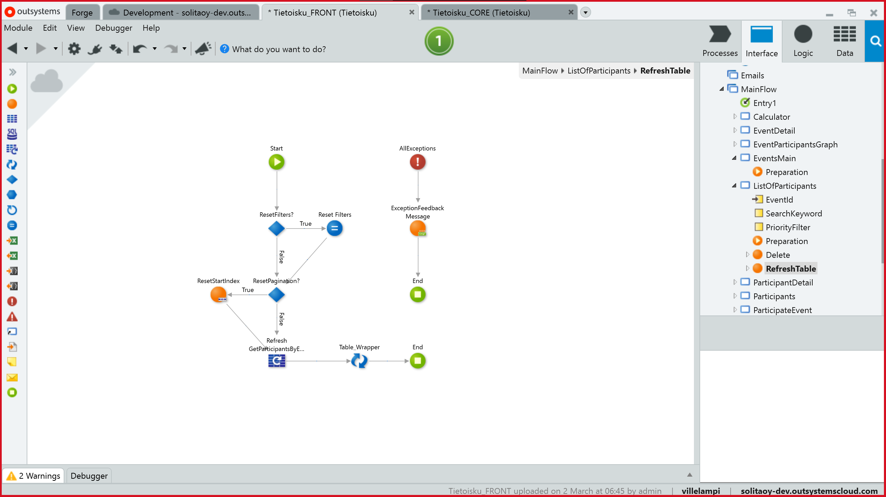
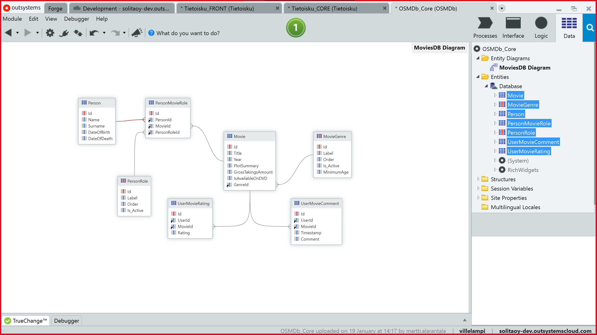
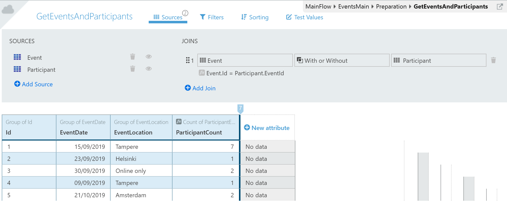
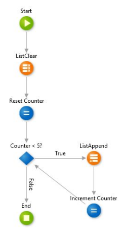
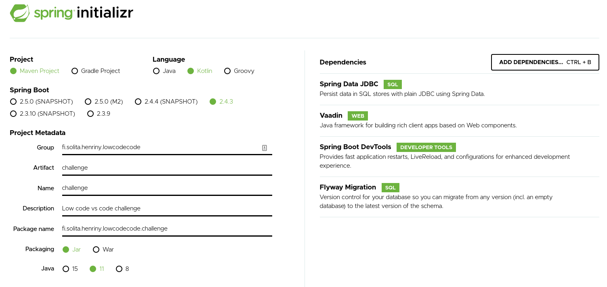
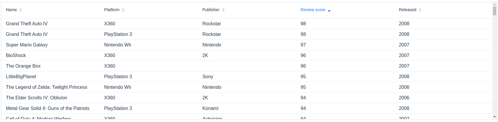
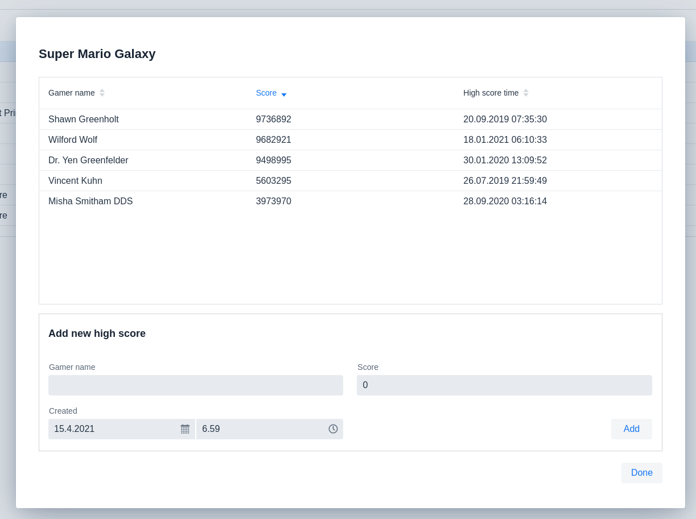
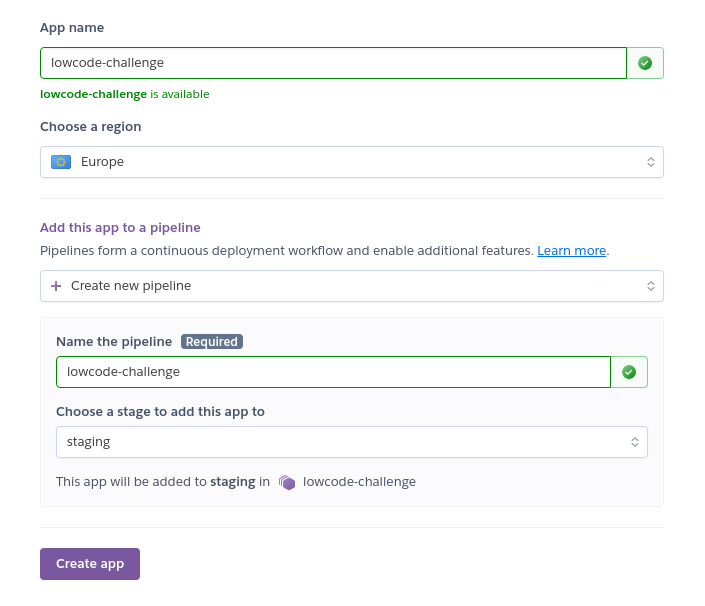
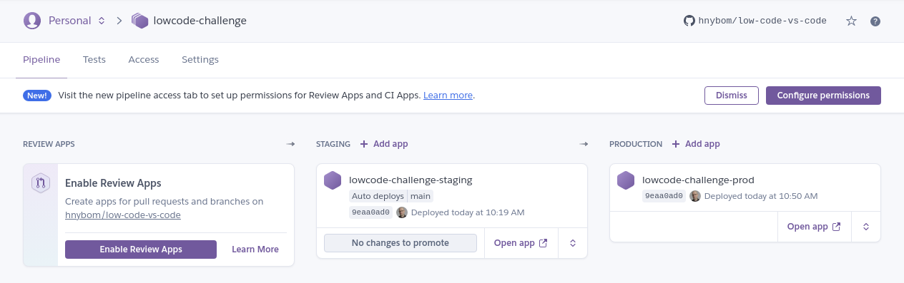

layout: post
title: I challenged low-code with code
author: hnybom
excerpt: > Low-code platforms will account for 65% of application development by 2024. Why? Can low-codes productive gains be challenged with traditional coding? In this blog I'm going to try to find out.

tags:
 - Low-code
 - OutSystems
 - Spring
 - Vaadin
 - Kotlin

# Low-codecalypse

Low-code platforms will account for 65% of application development by 2024 says Gartner 

> https://venturebeat.com/2021/02/14/no-code-low-code-why-you-should-be-paying-attention/

Development with the low-code platforms is stated to be 5 to 7 times faster than traditional development. Time to apply for early retirement I guess, so long and thanks for all the fishes!

Well...maybe not, there still might be a chance for us traditional developers as well. There is a broad catalog of open source components that do similar things that low code does. I'll demonstrate how you write applications with low-code platforms and how you can challenge the productive gains with open source components.

## So why is low-code so great?

I'm going to use OutSystems as the representation for low-code platforms. OutSystems is a platform I've used and I also have a OutSystems developer certificate. So I know at least something about it. The intention of this blog is not to undersell low-code. On the contrary I feel that OutSystems can do many things very well, not all, but many.

Low-code platforms usually use graphical based programming where many commonly used features come out of the box. From these graphical presentations OutSystems creates C# code and jQuery or React based web applications. If you're interested to learn  OutSystems they provide a free developer environment to test out the platform and, in my opinion, one of the best practice materials I've come across:

>  https://www.outsystems.com/training/paths/

I'm going to focus on certain aspects of development so this is not a deep dive to low-coding. For that I recommend the learning material. Lets start with focus on OutSystems and after that see what traditional coding can offer.

### Development environment 

In OutSystems the development is always done in the cloud environment. This has multiple implications

* No need to setup anything 
* The environment is shared with all the developers
* Internet connection is needed for the development

You write your applications mainly with the OutSystems service studio IDE. Service studio is currently a Windows only tool so that restricts the developer to windows platform. OutSystems is building a new cross-platform version of the service studio so after that you'll be able to use it with a mac as well. Service studio has different views for the processes, UI, logic and data. All of them are graphical by nature 



***OutSystems service studio logic view***

For developing native C# components OutSystems offers integration studio and for managing the different environments you use the lifetime web application.

OutSystems offers a marketplace called Forge to share your components and libraries with other developers. Even as it's called a marketplace it's only free components. You can think of it like a npm.

### Data access

Data access consists of two parts, data mapping to code objects and accessing data from the database. OutSystems provides these functionalities in a standard way that is built into the platform. 

OutSystems uses ORM technology as its data access. It also generates the DB schema based on the created entities in a similar way as hibernate does when hbm2ddl.auto is set to update the DB. As you know use of hbm2ddl is discouraged in production as it can lead to unforeseen consequences with the DB schema. In my experience this is also the case with OutSystems. If you e.g. drop a property from an entity the column will stay in the DB it's just hidden. The same is true if you delete an entity the table will still be there. This will not break the system but will lead to a bloated DB. This is undoubtedly fast but also little risky.

The modeling with OutSystems is done  by a graphical interface where you create the entities. This combines the creation of entity models and the DB structure. OutSystems can generate a entity model diagram of selected the entities and their relations for quick overview of the DB structure.



***OutSystems entity diagram***

OutSystems creates basic CRUD methods to access the data automatically and you can create your own aggregates. Aggregations are done with drag and dropping entities to a excel like interface where you define the query parameters, functional attributes and joins. OutSystems shows a preview of the fetched data so you can immediately see how changes affect the results.



***OutSystems aggregate creation***

In the picture the event table is left joined, "with or without" in OutSystems terms. It also has a functional attribute ParticipantCount.

With OutSystems you can also use custom SQL-queries to access data. So the access pattern is really comprehensive. This kind of shows that developing with OutSystems really requires coding knowledge and is not just magic all over the place. 

### Front-end 

OutSystems has multiple variants for front-ends. 

* Traditional web applications -  HTML page with jQuery 
* Reactive web applications - React based responsive application with PWA capabilities. 
* Mobile applications - React native applications.

With OutSystems creating views are done using components such as a lists. To populate a list with data you create a data aggregate from your entities and then drag and drop the fields of the aggregate to the list. This creates a list component with the selected fields. Same model applies to other components as well. Using components is the main benefit of OutSystems. The speed which you can create views with composing them of components and then populating them with data is very fast. The quite tight coupling of the database entities and UI is somewhat worrying but OutSystems tooling does help with that as it will point out errors caused by changes in the DB entities and disable deployment.

OutSystems also has a large catalog of view templates that you can use as a basis for your application. Templates create views that are already populated with components and then you can select what data is used in the views components. You can also add and remove components to suit the application needs. You can find the built-in templates at

> https://outsystemsui.outsystems.com/OutSystemsUIWebsite/ScreenOverview?RuntimeId=2

### Logic

Writing logic is probably the thing you do most when coding. With OutSystems you use graphical presentation to implement your logic operations. This is depicted below. 



***OutSystems logic***

The above logic is from my training application when I studied for the certificate exam. The idea is to populate a 5 element array with boolean values that indicate if a star is on or off for a movie rating.  So basically the above code is equivalent to this

```kotlin
val list = MutableList()
for(i < 5) {
    list.add(i < rating)
}
return list
```

OutSystems has also feature called business process orchestration which is used to model long-running work-flows in a visual manner. This is done in a similar visual presentation which helps in the design as it can be shown to the business owners in a manner they can understand.

When the graphical presentation is not enough OutSystems supports C# extensions where you use C# to write your logic. 

### Deployment

OutSystems platform can be run in 

* OutSystems cloud own environment 

* Your own cloud environment like Azure

* On-premise installation

I'll concentrate on the OutSystems cloud where you get 3 stages out of the box (dev, test and prod). You can publish your changes straight from the service studio with it's one click deployment to the dev environment. To promote the application version to higher stages you use the lifetime web application. Publishing changes can cause merge conflicts when multiple developers are working on the same thing. Merging is little hard with OutSystems as the presentation is graphical. Service studio tries to highlight the conflicts but it's not easy to do merging. It's actually recommended that only two developers work with the same modules at once. The rational is that with OutSystems the speed is higher so you don't even need more. This does help with the merging as well as there won't be as many conflicts.

This is continuous deployment but with human interaction. Lifetime does have APIs to integrate e.g. jenkins to it You can find more information from the link below

> https://success.outsystems.com/Documentation/How-to_Guides/DevOps/How_to_automate_container_deployment_by_using_LifeTime_API_v2_and_Jenkins

For automated testing OutSystems has a separate BDD framework that you need to add for your testing project. This is out of scope of this blog. More info at

> https://success.outsystems.com/Documentation/How-to_Guides/DevOps/How_to_Automate_Unit_Testing_and_API_Testing

So in summary you get 3 environments and manually triggered deployment to them. Anything more requires just as much work as it does with any other CI / CD solution.

## A challenger appears

As promised I'm going to build a simple web application and compare it's development through the aspects covered in the previous OutSystems chapter. The application will be a really simple web application for game high scores. The features

* A list of games 
* Game high scores 
* A form to add more high score entries to a game.

To challenge the the speed of low-code I'm going to use the following stack 

* **Vaadin** **flow** for front-end 
* **Spring boot** for backend server
* **Spring data JDBC** for DB access
* **Kotlin** as the programming language

### Development environment 

To save some time on starting the development I'm going to use spring initializr web app 

> https://start.spring.io/ 

to generate the needed skeleton for the project. 



***Spring initializr UI***

In the initilizr you just fill in the information about the project and select languages and dependencies you want to use. After that you just download the skeleton as a zip-file. 

I'm going to develop the application on my local machine so I need a local dev environment that can be easily debugged and tested. Spring boot is pretty self contained but what I need is a database. For this I'll use docker compose to quickly get a local testing portgresql database.

```
version: "3.7"
services:
  low-code-postgres:
    container_name: low-code-postgres
    restart: always
    image: postgres:latest
    volumes:
      - ./database:/var/lib/postgresql/data
      - ./shared:/shared
    ports:
      - "127.0.0.1:5432:5432"
    environment:
      POSTGRES_USER: lowcode
      POSTGRES_PASSWORD: vscode
      POSTGRES_DB: lowcodedb
```

To start the db I just need to issue `docker-compose up` command.

In reality that really didn't take too much time but it's still more than getting everything out of the box. 
### Data Access 

For DB access there is a wide spectrum of libraries to provide different level of abstraction for accessing the database. For my application I've chosen spring data JDBC. Spring data JDBC is not as comprehensive as a full ORM. My reasoning against ORMs like JPA is the complexity. It wouldn't be a problem in a simple app as this but in a large scale application all the features can be confusing and cause more complexity than they resolve. Spring data JDBC doesn't have lazy loading or sessions where the state of an entity is tracked. I like the opinionated simple approach where you know what you get and there is not much magic behind the scenes.

For the database schema I need migrations and for the code side data models. For database migrations I'll use flyway which integrates into the spring boot application. I only need to write the SQL script files and they will be run when the application starts. 

The spring data entities are the following two

```kotlin
@Table("games")
data class Game(
    @Id
    val id: Long?,
    @Version
    val version: Long?,
    val name: String,
    val genre: String,
    val platform: String,
    val publisher: String,
    val rating: String,
    @Column("release_year")
    val releaseYear: Int,
    @Column("review_score")
    val reviewScore: Int,
    val highScores: Set<HighScore>) 

@Table("high_scores")
data class HighScore(
    @Id
    val id: Long?,
    @Column("game_id")
    val game: Long?,
    @Column("gamer_name")
    val gamerName: String,
    val score: Long,
    val created: LocalDateTime
)
```

Spring data maps the DB tables to these data classes using the property names or the `@Column` annotation instructions. It also takes care of optimistic locking with the `@Version` annotation.

> **A note about optimistic locking.** Spring data JDBC supports optimistic locking at the aggregate root level, the game entity in this case. This is quite a wide lock as you should be able to add multiple high scores independently. In this demo application it's just fine but in a real world case take this into consideration.

To match the magic of OutSystems spring data provides quick methods for DB access by simply creating a repository interface.

```kotlin
@Repository
interface GameRepository : PagingAndSortingRepository<Game, Long> {

    fun findByNameContainingIgnoreCase(name: String, pageable: Pageable): List<Game>

    @Query("select * from games where name like :name and review_score >= :minScore")
    fun findByNameAndMinimumScore(name: String, minScore: Int): List<Game>

}
```

Spring automatically generates an implementation based on the signature of the interface. So 

`fun findByNameContainingIgnoreCase(name: String, pageable: Pageable): List<Game>`  

will create a method for finding games where the name contains the name parameter value. The pageable parameter enables sort and paging for this query. 

Custom queries are supported with annotations like in the `findByNameAndMinimumScore` function. One important thing to note is the extension of `PagingAndSortingRepository<Game, Long>` this creates a large set of CRUD methods for free. This matches and exceeds the functionality found in OutSystems for writing simple queries.

For more complex queries we can use jdbc template to write pure SQL. In my opinion this kind of hybrid a repository model works well since you will need the basic CRUD methods as well as the more complicated ones. With spring data you get the CRUD and extra basically for free.

### Front-end

There are many great alternatives for creating rich client applications. I've chosen Vaadin flow which enables very fast UI development. With Vaadin flow the UI is implemented at the backend and the actual client code is generated from the Kotlin / Java code. The UI Components generate events that you listen to e.g. value changed and so on. Vaadin takes care of the communication between the client application and the backend so you can just concentrate on writing the logic. I've also added karibu dsl library that enables structured coding style using the idea behind Kotlin's type-safe builders

> https://kotlinlang.org/docs/type-safe-builders.html

Following code will create a grid view of the games in the database.

```kotlin
verticalLayout {
    h2("Games")
    grid(dataProvider = DataProviders.getDataProvider(gamesRepository)) {
        addColumn(Game::name).setHeader("Name").setSortProperty("name")
        addColumn(Game::platform).setHeader("Platform").setSortProperty("platform")
        addColumn(Game::publisher).setHeader("Publisher").setSortProperty("publisher")
        val rs = addColumn(Game::reviewScore).setHeader("Review score").setSortProperty("reviewScore")
        addColumn(Game::releaseYear).setHeader("Released").setSortProperty("releaseYear")
        sort(
            GridSortOrderBuilder<Game>().thenDesc(rs).build()
        )
    }
}
```

The structured style immediately shows how the actual UI layout constructed. The key points here are the grid's data provider and the mapping of grid columns to the model properties. The data provider is a Vaadin concept that provides data for the UI component. For this purpose I wrote a little helper object and extension to Vaadin Query class to generate data providers from spring data repositories.

```kotlin
fun <T, F> Query<T, F>.toSpringDataPageRequest() =
    PageRequest.of(offset / limit, limit, VaadinSpringDataHelpers.toSpringDataSort(this))

object DataProviders {

    fun <T,ID> getDataProvider(pagingAndSortingRepository: PagingAndSortingRepository<T,ID>): DataProvider<T, Void> {
        return DataProvider.fromCallbacks(
            { pagingAndSortingRepository.findAll(it.toSpringDataPageRequest()).stream() },
            { pagingAndSortingRepository.count().toInt() }
        )
    }
    
}
```

This uses callback functions to the repository interface to get the actual data as well as the count. The grid is lazy loading and sortable. Behind the scenes data is queried for the next page when user scrolls the grid and when sorting is applied. 



***Vaadin games grid***

Now I've the games listed and I want to show the high scores for them. I'll create a Vaadin dialog with another grid of high scores and a form that is used to add more of them. 

The high score grid is similar as the games grid and it gets it's data from the games entity's set of high scores.

For the high score form I'll create a form with Vaadin components as inputs. Vaadin has a binder concept where you can bind object instances to form inputs and it will populate the data from and to the object instance. Vaadin inputs support validation and you only write the validation logic once and it's executed both in the browser and the server. For different types of data there are a bunch ready made input types such as a date picker. Bellow is a code snippet for high score addition. 

```kotlin
verticalLayout {
    addClassName("add-high-score-form")
    h4("Add new high score")
    formLayout {

        val binder = BeanValidationBinder(HighScoreUIModel::class.java)

        textField("Gamer name") {
            bind(binder).trimmingConverter()
            .withValidator({ name -> name?.isNotEmpty() ?: false}, "Name cannot be empty")
            .bind("gamerName")
        }

        integerField ("Score") {
            bind(binder)
            .withValidator({ score -> score ?: 0 > 0 }, "Score needs to be larger than 0")
            .bind("score")
        }

        dateTimePicker("Created") {
            bind(binder)
           .withValidator(
               { created -> created?.isBefore(LocalDateTime.now()) ?: false },
               "Time cannot be in the future or empty"
           )
           .bind("created")
        }

        binder.bean = HighScoreUIModel(gameId = gameId)

        horizontalLayout {
            button("Add") {
                addClickListener { handleAddition(binder) }
            }
            justifyContentMode = FlexComponent.JustifyContentMode.END
            setWidthFull()
        }
    }
}

private fun handleAddition(binder: Binder<HighScoreUIModel>) {
    if (binder.validate().isOk) {
        EventBroker.sendEvent(
            HighScoreAdded(
                game = gamesService.addHighScoreToGame(binder.bean)
            )
        )
        binder.bean = HighScoreUIModel(gameId = gameId)
    }
}
```

First in the code we create the presentation for the form and it's validations. For the add button there is an action handler to save a new high score to the database. The save logic is in the `handleAddition` function. This is what the whole dialog looks like.



You've might have noticed the event broker in the handle function. That is an extra feature I added to support cross browser data updates with push. It needs Push annotation to the Vaadin application shell.

```kotlin
@Push
class ApplicationShell : AppShellConfigurator 
```

The `@Push` annotation enables reactive functionality so you can "push" changes from the backend threads to the front-end through a web socket. The event broker is custom code that uses a simple memory based registry of listeners of events. I use it for example to refresh the high score dialog grid for added high scores

```kotlin
// Listener
with(EventBroker) {
    registerForEvents(HighScoreAdded::class.java) {
        if (it.game.id == game.id) {
            game = it.game
            // Push event to the front end with synchronized access to Vaadin session
            ui.get().access {
                grid.setItems(DataProvider.ofCollection(game.getSortedScores()))
                grid.refresh()
            }

        }
    }
}

//---------

// Triggering
EventBroker.sendEvent(
    HighScoreAdded(
        game = gamesService.addHighScoreToGame(binder.bean)
    )
)
```

This means that if the dialog is open in multiple different browsers they update their grid if a new high score is added. This works both for the user who is adding the high score as well as others who have the same dialog open.

### Logic

I've encountered a little problem. My application is so simple it has hardly any business logic. So let's revisit the example from the OutSystems chapter. If you recall it used a loop to populate an array with five boolean values. I remember that when I was doing the exercise it felt really cumbersome to write, or actually draw. The reason it felt that way is that it really was slow and not a natural way for me to express what I wanted. With Kotlin I would write it like this

```kotlin
fun createStarArray(rating: Int) = (0..4).map { it < rating }
```

When it comes to implementing logical operations traditional coding is faster and for a coder it's also easier to read. For a non coder the graphical version might be more natural way to read and write the logic.

OutSystems long-running business processes are little bit out of scope here but there are OS tools to achieve similar modeling. I'll just list some of the tools here and won't go through them in any more detail

* https://spring.io/projects/spring-statemachine
* https://www.activiti.org/
* https://camunda.com/products/camunda-platform/

### Deployment

Modern cloud platforms are pretty great as they are basically infrastructure implemented with software but even that requires you to define what you need in a quite detailed manner. 

To achieve similar level of "out of the boxness" as OutSystems I decided to host my application in Heroku. Steps to get a deploymen pipeline in Heroku 

* At Heroku web site and registerer an account.
* Create an deployment pipeline. 
* Add 2 applications to the pipeline, staging and prod. 
* Link applications to github repository
* Add postgresql database add-on.



***Application creation dialog***



***Deployment pipeline***

Heroku automatically detected that I had an spring boot application and build and deployed it to staging. It also set the database environment variables so that the spring would pick them up and use that for it's database. This took literally 10 minutes and the cost for a small application is 0€. 

> **Note** the free level at Heroku isn't really feasible for production level software
>
> * It turns itself off if there's no traffic for 30 minutes 
> * Has a cap of 10 000 rows in the DB.

I'd say Heroku is pretty close to getting ready made environment. Heroku also has the concept of review apps where it will create a new environment from pull request for testing. It costs extra so I didn't enable them. On top of the CD functionality Heroku offers a CI testing as well but this is also a paid feature so I didn't use it.

The application in this blog is available for a limited time at

>  https://lowcode-challenge-staging.herokuapp.com/

and

> https://lowcode-challenge-prod.herokuapp.com/

Also source code for it is available at

>  https://github.com/hnybom/low-code-vs-code

## Final thoughts

Here's a side by side comparison of the different aspects between OutSystems and Code

| Category        | OutSystems                                                   | Code                                                         |
| --------------- | ------------------------------------------------------------ | ------------------------------------------------------------ |
| **Data access** | Automatic generation for basic access and data mapping. Also supports complex queries with SQL | Automatic generation for basic functionality, signature based query generation as well ass support for SQL queries |
| **Front-end**   | Large template and component library for creating views as well as support for mobile applications. There is not that much room to customize the look and feel efficiently. | View are composed of components that require coding to determine their functionality and data content |
| **Logic**       | Graphical interface for writing logic which easy to read even if the reader doesn't understand code. The implementation is cumbersome compared to writing code. | Very powerful way of expressing logic in many different ways. This is the strong point of code. There is a steeper learning curve than in low-code. |
| **Deployment**  | Three stage environment out of the box. Automation and and testing need to be added manually. | Many cloud based options with different focus areas and complexities. You can select what you need. Requires some work but you can get quite automated process. |

With OutSystems you get a whole platform with it's strong points as well as weaknesses. It's a whole package take it or leave it. It's also quite expensive so in many ways it's a strategic decision as in reality your solutions will be tied to the platform. Yes I do know you can export OutSystems applications to be run independently, but in reality after the export you won't be developing them further. You do get 

With traditional coding there are huge amount of options, even too many I would say. You need expertise to select the right tools and components. The open source components need to be evaluated against their usefulness and the risk that they will be abandoned. This needs to be taken into account especially when considering the lifespan if the solution. 

So what about the speed of developing applications. In reality the development speed difference is not 5 - 7x it might be more like 1,5 - 2x faster when you develop real world applications and not just CRUD applications that directly interact with the database or integration source. 

The actual benefit you gain from low-code is that it enables more people to do coding as the learning curve is not that steep. That doesn't mean you don't need to understand software architecture because you real do. Otherwise the systems will become very hard to maintain and to develop further efficiently. I strongly disagree with the whole citizen developer idea in the context of production quality applications with long lifespans

> https://www.outsystems.com/blog/posts/citizen-developer/

So where does this leave us? Is low-code going to take over the solution landscape? Low-code will lower the bar for investment decisions to build solutions. Especially if you have already bought the platform. This means companies will create more applications internally as externally. So instead of replacing the traditional solutions there will just be more of them and applications will be built by wider group of developers. Which in turn will accelerate the need of more features and APIs for other systems like the existing backend solutions. I would thus argue this mean even more demand for all kinds of developers.