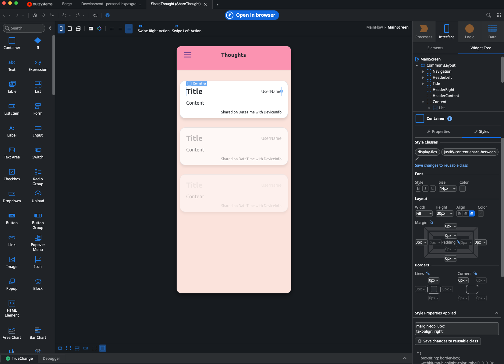
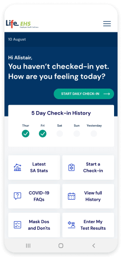
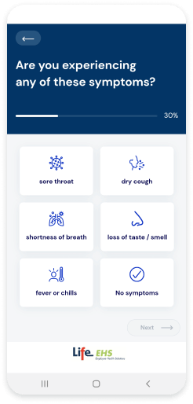
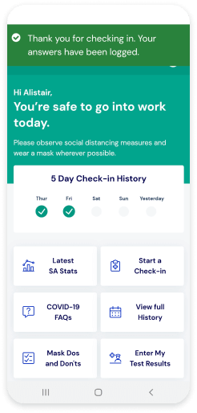

--- 
layout: post 
title: I feel the need, the need for speed - rapid delivery of mobile apps with low code. 
author: michal.guspiel 
date: 2022-09-28 16:00:00 +0200 
excerpt: Honest review of OutSystems in the scope of mobile development – a perspective of 
the mobile developer. 
 
tags: 
  - Lowcode 
  - Outsystems 
  - Mobile 
--- 
 
The modern world is changing incredibly fast: technology evolves, customer preferences, needs, and wants change, and extraordinary things happen all of the sudden. Businesses must adapt and shift constantly. 
 
“The pace of change has never been this fast, yet it will never be this slow again” - Justin Trudeau. 
 
Having all of this in mind there is no surprise that there is a need for rapid delivery of IT solutions, some of which are mobile applications that are the main concern of this article. 
 
While traditional development provides the most flexible and optimized solution with the best potential user experience it has a few drawbacks. The most important ones are cost and time of delivery. Sometimes by juggling the priorities we can conclude that in certain cases, for instance, business-to-employee mobile applications, UX, and top-notch quality of a product are not the most important factors. Sometimes sound-speed quick time of delivery of an application with core functionalities with minimum cost would be a much better solution. 
 
Several companies make use of low code platforms like OutSystems to create essential business mobile applications.  
 
After the development of 25 applications with 25000 users, Rossman Poland reports that "rapid low-code development has made Rossmann a more agile organization". 
 
Additionally, Logitech states it has already developed 80 apps and to reduce 50% of the resources. If they find it useful why not at least give it a try?
 
## Pilot perspective – case OutSystems 
 
Outsystems provides us with a set of tools that enable the development of medium complexity cross-platform mobile applications. We can utilize native features of mobile devices like camera, touch identification, sensors, calendar access, location, and more. We can easily leverage the local storage and implement the synchronization logic so that the solution can be built offline first. The final product is not just the web application with the cover of a mobile app but a standalone application that has almost the same functionality as native or cross-platform applications do.
 
Assumptions that in low code development "UI customization is limited" and "UX is disappointing" are inaccurate. It is true, however, that OutSystems user interface customization was not built with native mobile developers in mind. It is because, to enable mobile app development OutSystems utilizes the Cordova framework. It is an open sourced technology that allows building cross-platform application using standard web technologies - HTML5, CSS3 and JavaScript. Therefore in order to customize user interface we must either use provided interface or CSS.

*OutSystems interface, UI customization section on right side*

 Nevertheless, after getting used to CSS it is possible to develop a user interface that is more than bearable for the product that was made with pace and budget as a priority. Certain limitations will decrease the quality of user experience but definitely will not ruin the product. There are always workarounds and some "fancy UI fireworks" can be changed into a different solution that is less fancy but also optimal and practical.  

*Example application - Life Healthcare*

What has to be mentioned is that application distribution is particularly easy. We have an option to distribute the product as PWA or a stand-alone application. Using the tool we can easily generate all the build types of Android and iOS applications. We can distribute it internally or publish it to the respective stores. Releasing a new version of the application is most of the time seamless and users are not required to perform any action to have their version updated. OutSystems takes care of the process. In certain cases, for instance, importing a new native plugin or changing the application icon the platform can not do its job and the application has to be updated traditionally.  
 
## It takes a lot more than just fancy flying 
 
Based on my elaboration it seems that OutSystems might be a great solution for a project where rapid delivery and low development cost are valued over UI and UX. It is true. From the developer's perspective, the biggest issue seems to be the unknown, unknown what is not possible to perform with a given technology. Sometimes we might lose some, or even a lot of time trying to achieve something that cannot be achieved and after realizing it we must adapt and find a good workaround. It is tiresome.  

OutSystems simplifies the process of software development greatly however, it is still relatively complex process. It involves careful planning, defining requirements, and specs. The procedure involves also thorough testing. The final product must be tested and evaluated properly and as carefully as with a traditional software product. 
  
If we are hasty and a low code platform is chosen as a tool to build the IT solution only because of the small cost of initial delivery we might discover that OutSystems or for that matter any low code platform is a two-edged sword. If the product requirements include several features that are necessary and difficult to build with such a tool it will not increase our productivity but the opposite. We must assess that the problem will not scale into a size that simply will overwhelm low code development possibilities. 
 
With experience and proper planning before building the solution, we can address those scenarios and assess if low code platform is a good choice for the project. By doing so we can avoid the danger zone and provide clients, users, and ourselves with a great flight. 

 
<iframe src="https://giphy.com/embed/Q66yosSHcX5aOvgfbx" width="100%" height="100%" style="position:absolute" frameBorder="0" class="giphy-embed" allowFullScreen></iframe>

<a href="https://giphy.com/gifs/unitedstatesnavy-leaving-take-off-f35-Q66yosSHcX5aOvgfbx">via GIPHY</a>

## References  
 
 - [Rossman story](https://www.outsystems.com/case-studies/rossmann-poland-drug-store-retail-solutions/) 
 - [Logitech story](https://www.outsystems.com/case-studies/fast-development/) 
 - [Example app - Life Healthcare](https://www.outsystems.com/case-studies/life-healthcare-mobile-liferisk-app/)