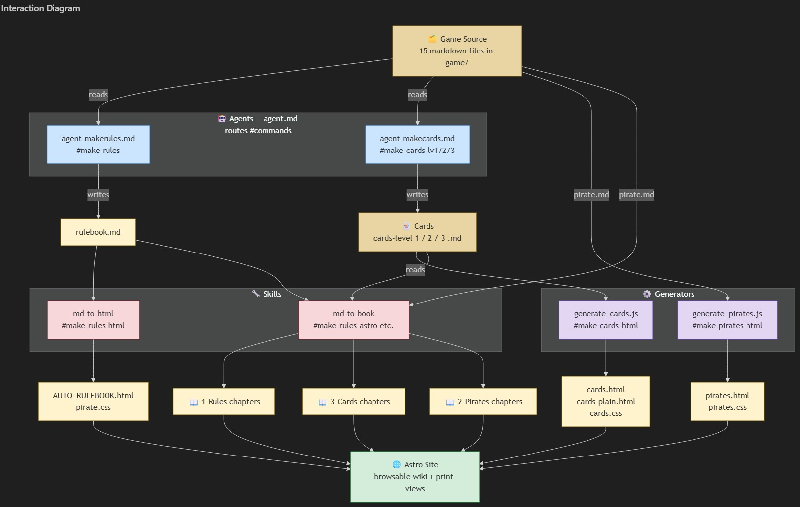

## The idea

I like creating games. Board games, card games, dice games — the kind you spread across a table with friends and argue about rules for twenty minutes before anyone actually plays. But I have a problem that every hobby designer knows well: I get stuck.

Not stuck on the big idea. The big idea is easy. "Pirates fighting for control of a council using dice and cards" — that took about five minutes. The hard part is everything after. Balancing 50 cards across three power levels. Making sure the trick-taking mechanic actually works with the dice drafting. Writing rules that a human being can read without falling asleep. These are the parts where projects stall, sit in a folder for six months, and quietly die.

So I had a thought: what if I approached this differently? What if instead of doing everything myself and burning out halfway through, I tried to use AI as a genuine collaborator? Not just "ask Claude to write some flavour text" but actually build an agentic workflow — where AI agents have defined roles, shared context, and can generate real, usable output.

That was the experiment. Build the game _and_ build the system for building the game, at the same time.

---

## The Game Folder

The first real decision was the format. If agents were going to help design and generate content, they needed structure. Not a Google Doc. Not a wiki. Markdown files in a folder.

I broke the game down into its moving parts and gave each one a file:

- `goal.md` — what are you trying to win?
- `setup.md` — what's on the table when you start?
- `turn.md` — what happens each round?
- `dice.md` — six faces, four colours, and the actions they trigger
- `card.md` — how cards are structured and costed
- `influence.md` — the scoring track
- `pirate.md` — four characters with unique abilities
- `court-market.md` — the economy

Each file is self-contained but they reference each other. A card's cost is defined in `card.md` but it relates to dice faces from `dice.md` and resources from `setup.md`. The whole `game/` folder is effectively a relational database written in prose.

This turned out to be one of the best decisions in the project. When I change how dice work, I update one file. When an agent needs to generate cards, it reads the relevant files and has full context. No ambiguity, no stale information buried in a long conversation thread.

The next step would be to include a package to generate a knowledge graph to enable more token efficent handling of the game data in the agents.

---

## The Agent Phase

With the rules in structured markdown, I started building agents. The main agent (`agent.md`) became a router — a traffic controller that takes a command like `#make-cards-lv2` and knows exactly which subagent to call, what files to feed it, and where to save the output.

The first subagent was the rules generator. I wrote `agent-makerules.md` with detailed instructions: read all the game source files and compiles them into a single, coherent rulebook with a table of contents, include directives for appendices, and pagebreak annotations for PDF output.

The card generator came next. `agent-makecards.md` was also tricky to get right since I had to be very strict since the agent kept inventing it's own rules and inventing novel ways to allocate build points. But when it started working it read the card construction rules, read the dice mechanics, read the pirate theme word list, then generated Level 1,2 and 3 cards with specific distributions to make each card set balanced. The agent reads the game files as shared context so every generated card is mechanically consistent.

Then I needed to turn markdown into something people could actually use. This is where Claude became indispensable. Together, we started to build skills:

**md-to-html** was the first. A Node.js script using `marked` and `cheerio` that converts markdown to styled HTML with six different themes. It handles include directives (so the rulebook can pull in the quick reference and strategy guides), heading offsets, pagebreak annotations, and section classification. The pirate theme has skull ornaments and parchment backgrounds.

**html-to-pdf** came next. A Puppeteer-based converter that launches a headless browser, loads the HTML with screen media emulation (so the CSS renders faithfully), and prints to PDF.

Each skill is self-contained in `.github/skills/` with its own `SKILL.md` instruction file and scripts. The main agent knows when to call each one. Type `#make-rules-pdf` and it chains md-to-html then html-to-pdf. Type `#make-rules-astro` and it runs md-to-book then copies the print-friendly files.

The agent commands grew organically. Every time I thought "I keep doing these three steps manually," I added a command. The agent file became a menu of one-word triggers that execute multi-step pipelines.

---

## The Publishing Phase

At some point the game had rules, cards, characters, and PDFs. But sharing PDFs felt limiting. I wanted a browsable site — something that looked good, had navigation, and could be updated easily.

I found an Astro wiki-book template that was close to what I needed. Astro's static site generation was perfect: markdown in, HTML out, fast, light in footprint. I set up the project in an `astro-site/` subfolder and started adapting.

The template used a book/chapter structure with YAML metadata and markdown content — now i needed a md-to-book skill:

**md-to-book** It takes a markdown file and splits it into a site-compatible book structure — a `book.yaml` metadata file and individual `chapter-XX.md` files with proper formatting. It resolves includes, rewrites image paths, and ensures every piece of content sits under a heading that matches its section entry.

A bit of configuration (`srcDir`, `publicDir`, `outDir` pointing into the subfolder) and the site was reading generated content.

Then the theming. The template's default look was clean but generic. I rewrote `global.css` with a pirate colour palette — parchment backgrounds, red accents, gold highlights, Palatino serif fonts. The chapter pages got small-caps headings, dotted borders on subheadings, accent-coloured bold text, and skull-and-crossbone dividers between sections. It looks like something you'd find in a captain's quarters.

For print-friendly views, I added a `linkInsteadOfParts` property to the book system. Books with this property show their linked HTML file in a full-height iframe instead of chapter navigation. The print-friendly rulebook, card sheets, and character sheets are all accessible this way — same content, different presentation.

The last piece was making republishing painless. After rule changes, regenerating the site rules is a series of agent commands:

```
#make-rules           → rebuild the rulebook from game sources
#make-rules-pdf       → generate rules html + pdf
#make-rules-astro     → generate book chapters + copy print files(html files)
```

next logical step is to make a publishing sub agent that handles all of this and that the top agent only has the different publish commands like #publish-rules.

`npm run dev` to preview. `npm run build` to ship.

---

## Diagram of the solution



---

## How It Turned Out

I set out to create a board game. What I actually built was two things: a pirate-themed dice-and-card game _and_ an ai assisted content pipeline.

The game folder is the source of truth. Edit a rule, run a few commands, and the rulebook, HTML files, PDFs, card sheets, and web site all update. The agents generate cards that are mechanically consistent with the rules. The skills convert between formats without manual intervention. The Astro site presents everything in a browsable, themed interface.

It's not what I planned. I planned to make a game. The pipeline just... happened, one problem at a time. "I need cards" became an agent. "I need a PDF" became a skill. "I need a website" became a static site generator. Each piece solved an immediate problem but they composed into something larger.

Claude has been a tremendous help in this process. Not just as a code generator but as a design partner — suggesting approaches, catching edge cases, writing a lot of code. The agentic workflow turned what would have been a solo grind into something that felt collaborative and, honestly, fun.

Funny how it turns out sometimes. You start with a pirate game and end up building a content generation and deploy pipeline.

Ohh, by the way I setup my github to talk to vercel so pushing to main builds the astro site out to: https://pirates-court.vercel.app
